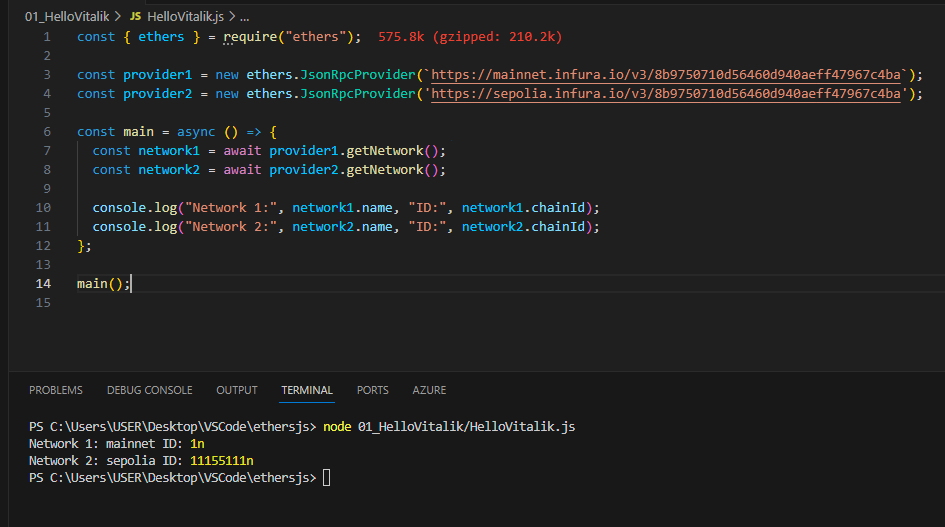
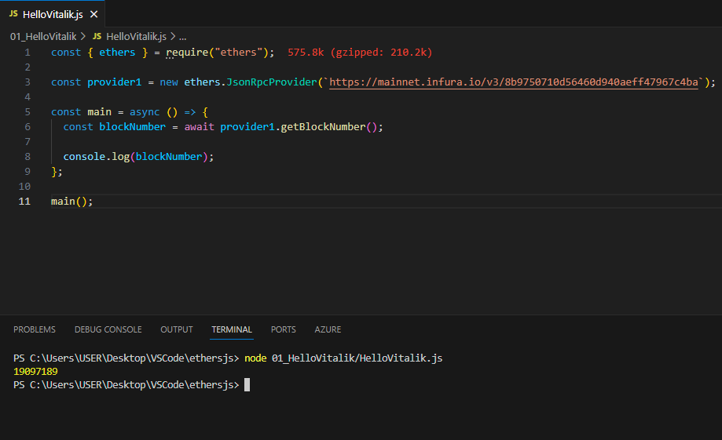
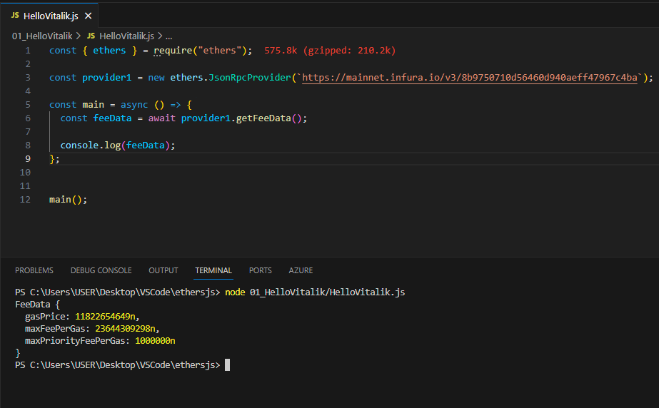
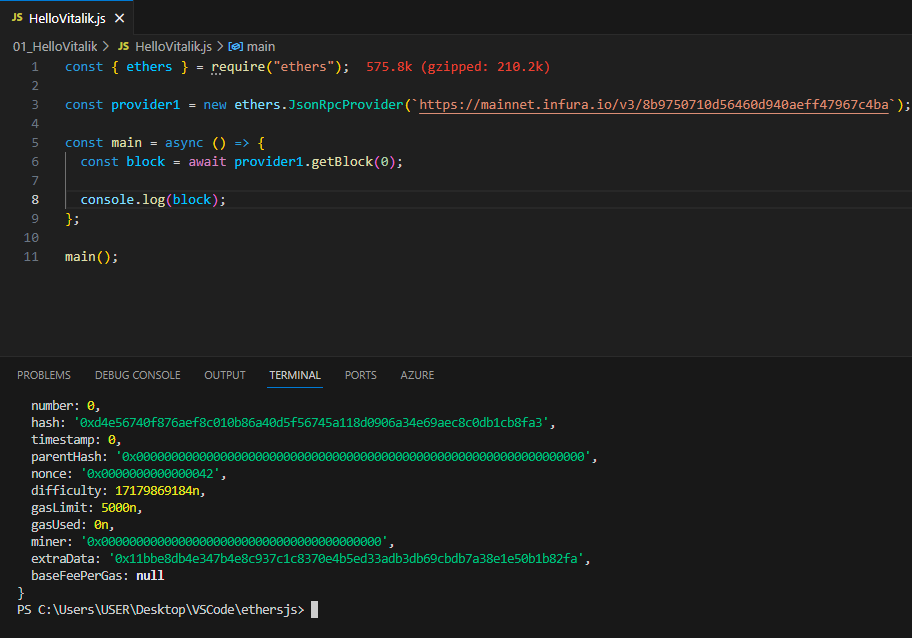
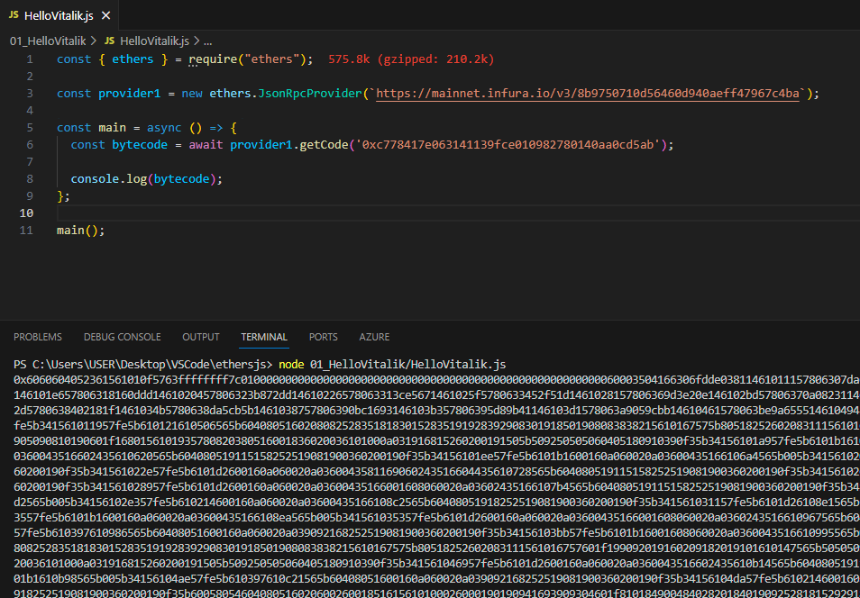

# WTF Ethers: 2. Provider

I've been revisiting `ethers.js` recently to refresh my understanding of the details and to write a simple tutorial called "WTF Ethers" for beginners.

**Twitter**: [@0xAA_Science](https://twitter.com/0xAA_Science)

**Community**: [Website wtf.academy](https://wtf.academy) | [WTF Solidity](https://github.com/AmazingAng/WTFSolidity) | [discord](https://discord.gg/5akcruXrsk) | [WeChat Group Application](https://docs.google.com/forms/d/e/1FAIpQLSe4KGT8Sh6sJ7hedQRuIYirOoZK_85miz3dw7vA1-YjodgJ-A/viewform?usp=sf_link)

All the code and tutorials are open-sourced on GitHub: [github.com/WTFAcademy/WTF-Ethers](https://github.com/WTFAcademy/WTF-Ethers)

-----

In this lesson, we will introduce the `Provider` class in ethers.js and use it to connect to a node to retrieve information from the blockchain.

## `Provider` Class

The `Provider` class provides an abstraction for connecting to the Ethereum network and offers a concise and consistent interface for standard Ethereum node functionality. In `ethers`, the `Provider` class does not handle user private keys and can only read information from the blockchain, making it safer compared to `web3.js`.

In addition to the default provider `defaultProvider` mentioned [previously](https://github.com/WTFAcademy/WTF-Ethers), the most commonly used provider in `ethers` is `jsonRpcProvider`, which allows users to connect to a specific node service provider.

## `jsonRpcProvider`

### Creating an API Key for the Node Service Provider

First, you need to register and create an API Key on the website of the node service provider. In the "Tools" section of the "WTF Solidity" tutorial, we introduced the methods to create API Keys for two projects, Infura and Alchemy. You can refer to the tutorial for more information.


### Connecting to Infura Node

Here, we will use Infura as an example. After creating the Infura API Key, you can create a `Provider` variable using the `ethers.JsonRpcProvider()` method, which takes the URL of the node service as a parameter.

In the following example, we create providers to connect to the `ETH` mainnet and the `Goerli` testnet:

```javascript
// Connect to the Ethereum network using Infura's RPC node
const INFURA_MAINNET_URL = 'https://mainnet.infura.io/v3/8b9750710d56460d940aeff479672b3a';
const INFURA_GOERLI_URL = 'https://sepolia.infura.io/v3/8b9750710d56460d940aeff479672b3a';
// Connect to the Ethereum mainnet
const providerETH = new ethers.JsonRpcProvider(INFURA_MAINNET_URL)
// Connect to the Sepolia testing network
const providerSepolia = new ethers.JsonRpcProvider(INFURA_SEPOLIA_URL)
```

### Using the `Provider` to Retrieve Blockchain Data

The `Provider` class provides convenient methods to retrieve data from the blockchain:

**1.** Use the `getBalance()` function to retrieve the `ETH` balance of Vitalik on the mainnet and the Goerli testnet:

```javascript
    // 1. Retrieve the ETH balance of Vitalik on the mainnet and the Sepolia testnet
    console.log("1. Retrieving the ETH balance of Vitalik on the mainnet and the Sepolia testnet");
    const balanceETH = await providerETH.getBalance(`vitalik.eth`);
    const balanceSepolia = await providerSepolia.getBalance(`vitalik.eth`);
    // Output the balances on the console (mainnet)
    console.log(`ETH Balance of Vitalik: ${ethers.formatEther(balance)} ETH`);
    // Output the Sepolia testnet ETH balance
    console.log(`Sepolia ETH Balance of Vitalik: ${ethers.formatEther(balanceSepolia)} ETH`);
```


**2.** Use the `getNetwork()` function to check which chain the provider is connected to. `homestead` represents the `ETH` mainnet:

```javascript
    // 2. Check which chain the provider is connected to
      const network1 = await provider1.getNetwork();
  const network2 = await provider2.getNetwork();

  console.log("Network 1:", network1.name, "ID:", network1.chainId);
  console.log("Network 2:", network2.name, "ID:", network2.chainId);
```
> In ethers v6, the above code cannot directly `console.log()` the `network` object. Refer to the [discussion-3977](https://github.com/ethers-io/ethers.js/discussions/3977) for the specific reason.



**3.** Use the `getBlockNumber()` function to retrieve the current block number:

```javascript
    // 3. Retrieve the current block number
    console.log("\n3. Retrieving the current block number")
    const blockNumber = await providerETH.getBlockNumber();
    console.log(blockNumber);
```



**4.** Use the `getTransactionCount()` function to retrieve the transaction count of a wallet address.

```javascript
    // 4. Retrieve the transaction count of Vitalik's wallet
    console.log("\n4. Retrieving the transaction count of Vitalik's wallet")
    const txCount = await providerETH.getTransactionCount("vitalik.eth");
    console.log(txCount);
```


**5.** Use the `getFeeData()` function to retrieve the current recommended gas settings, which are returned as `bigint`.

```javascript
    // 5. Retrieve the current recommended gas settings
    console.log("\n5. Retrieving the current recommended gas settings")
    const feeData = await providerETH.getFeeData();
    console.log(feeData);
```



**6.** Use the `getBlock()` function to retrieve information about a specific block. The parameter is the block number:

```javascript
    // 6. Retrieve information about a specific block
    console.log("\n6. Retrieving information about a specific block")
    const block = await providerETH.getBlock(0);
    console.log(block);
```



**7.** Use the `getCode()` function to retrieve the bytecode of a contract at a specific address. In the example below, we use the contract address of `WETH` on the mainnet:

```javascript
// 7. Retrieve the bytecode of a contract at a specific address, using the contract address of WETH on the mainnet as an example
console.log("\n7. Retrieving the bytecode of a contract at a specific address, using the contract address of WETH on the mainnet as an example")
const code = await providerETH.getCode("0xc778417e063141139fce010982780140aa0cd5ab");
console.log(code);
```



## Summary

In this lesson, we introduced the `Provider` class of ethers.js and create a `jsonRpcProvider` with Alchemy's node API key to read on-chain information from the `ETH` main network and `Goerli` test network.
