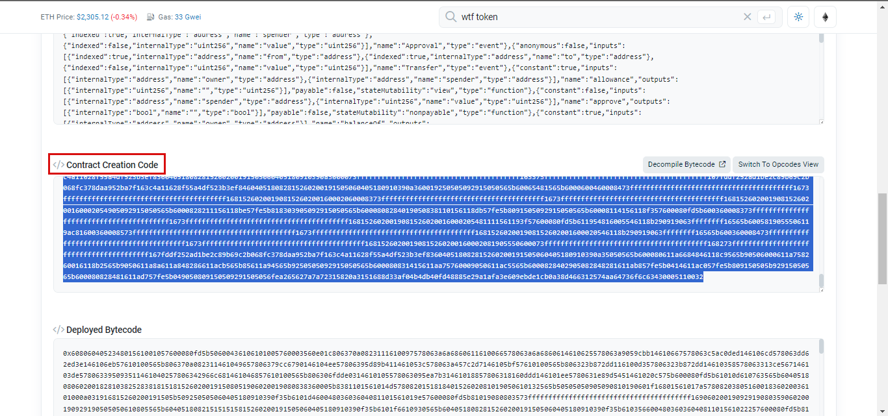
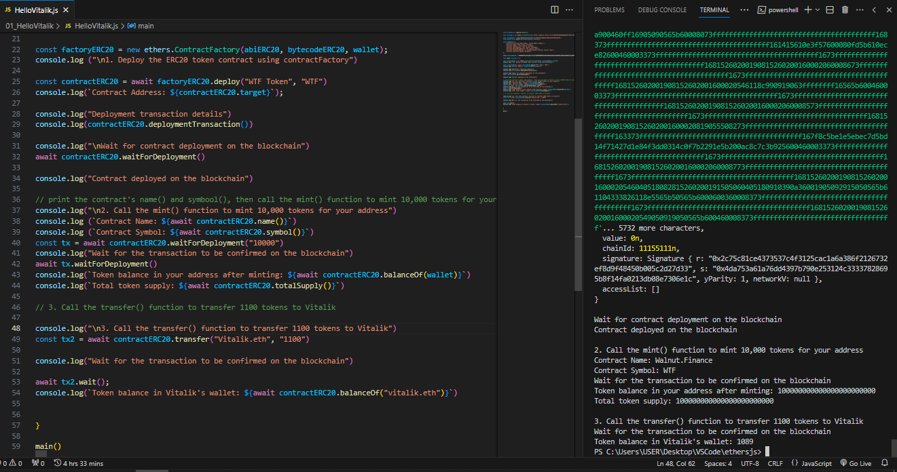

# WTF Ethers: 6. Deploy Contract

I've been revisiting `ethers.js` recently to refresh my understanding of the details and to write a simple tutorial called "WTF Ethers" for beginners.

**Twitter**: [@0xAA_Science](https://twitter.com/0xAA_Science)

**Community**: [Website wtf.academy](https://wtf.academy) | [WTF Solidity](https://github.com/AmazingAng/WTFSolidity) | [discord](https://discord.gg/5akcruXrsk) | [WeChat Group Application](https://docs.google.com/forms/d/e/1FAIpQLSe4KGT8Sh6sJ7hedQRuIYirOoZK_85miz3dw7vA1-YjodgJ-A/viewform?usp=sf_link)

All the code and tutorials are open-sourced on GitHub: [github.com/WTFAcademy/WTF-Ethers](https://github.com/WTFAcademy/WTF-Ethers)

-----

In this lesson, we will introduce the `ContractFactory` type in `ethers.js` and use it to deploy a contract.

## Deploying Smart Contracts

On Ethereum, deploying a smart contract is a special transaction: it involves sending the bytecode (creation code) obtained from compiling the smart contract to null address. If the contract has constructor arguments, you need to encode the arguments into bytecode using `abi.encode` and append it to the end of the contract bytecode. For an introduction to ABI encoding, refer to the WTF Solidity Tutorial [Lesson 27: ABI Encoding](https://www.wtf.academy/solidity-advanced/ABIEncode/).

## Contract Factory

`ethers.js` provides the `ContractFactory` type that allows developers to easily deploy contracts. You can create an instance of `ContractFactory` by providing the contract's `ABI`, compiled `bytecode`, and the `signer` variable to prepare for contract deployment.

```js
const contractFactory = new ethers.ContractFactory(ABI, bytecode, signer);
```

**Note**: If the contract has a constructor with arguments, the `ABI` must include the constructor.

After creating an instance of the contract factory, you can call its `deploy` function and pass the arguments `args` of the contract constructor to deploy and obtain an instance of the contract:

```js
const contract = await contractFactory.deploy(args);
```

You can wait for the contract to be deployed and confirmed on the chain before interacting with it using either of the following commands:

```js
await contractERC20.waitForDeployment();
```

## Example: Deploying an ERC20 Token Contract

For an introduction to the `ERC20` standard token contract, refer to the WTF Solidity Quick Start [Lesson 31: ERC20](https://github.com/AmazingAng/WTFSolidity/blob/main/31_ERC20/readme.md).

1. Create `provider` and `wallet` variables.
    ```js
    const { ethers } = require("ethers");

    // Connect to the Ethereum network using Infura's RPC node
    // Connect to the Sepolia test network
    const INFURA_SEPOLIA_URL = 'https://sepolia.infura.io/v3/8b9750710d56460d940aeff47967c4ba';
    const provider = new ethers.JsonRpcProvider(INFURA_GOERLI_URL);

    // Create a wallet object using the private key and provider
    const privateKey = '0x227dbb8586117d55284e26620bc76534dfbd2394be34cf4a09cb775d593b6f2b';
    const wallet = new ethers.Wallet(privateKey, provider);
    ```

2. Prepare the bytecode and ABI of the ERC20 contract. Since the ERC20 contract has a constructor with arguments, we must include it in the ABI. You can obtain the contract bytecode by clicking the `Bytecode` button in the compilation panel of Remix. The "object" field corresponds to the bytecode data. If the contract is already deployed onchain, you can find it in the `Contract Creation Code` section on etherscan.



   ```js
    // Human-readable ABI of ERC20
    const abiERC20 = [
        "constructor(string memory name_, string memory symbol_)",
        "function name() view returns (string)",
        "function symbol() view returns (string)",
        "function totalSupply() view returns (uint256)",
        "function balanceOf(address) view returns (uint)",
        "function transfer(address to, uint256 amount) external returns (bool)",
        "function mint(uint amount) external",
    ];
    // Fill in the contract bytecode. In Remix, you can find the bytecode in two places:
    // 1. Click the Bytecode button in the compilation panel.
    // 2. In the artifact file with the same name as the contract in the file panel's artifact folder.
    // The data corresponding to the "object" field under the "bytecode" attribute is the bytecode, which is quite long, starting with 608060
    // "object": "608060405260646000553480156100...
    const bytecodeERC20 = "608060405260646000553480156100...";
   ```


3. Create an instance of the contract factory `ContractFactory`.

    ```js
    const factoryERC20 = new ethers.ContractFactory(abiERC20, bytecodeERC20, wallet);
    ```

4. Call the `deploy()` function of the factory contract and provide the constructor arguments (token, name and symbol) to deploy the `ERC20` token contract and obtain the contract instance. You can use:
    - `contract.target` to get the contract address,
    - `contract.deployTransaction` to get the deployment details,
    - `contractERC20.waitForDeployment()` to wait for confirmation of contract deployment on the blockchain.

    ```js
    // 1. Deploy the ERC20 token contract using contractFactory
    console.log("\n1. Deploy the ERC20 token contract using contractFactory")
    // Deploy the contract and provide constructor arguments
    const contractERC20 = await factoryERC20.deploy("WTF Token", "WTF")
    console.log(`Contract Address: ${contractERC20.target}`);
    console.log("Deployment transaction details")
    console.log(contractERC20.deploymentTransaction())
    console.log("\nWait for contract deployment on the blockchain")
    await contractERC20.waitForDeployment()
    // You can also use contractERC20.deployTransaction.wait()
    console.log("Contract deployed on the blockchain")
    ```

    

5. After the contract is deployed on the blockchain, call the `name()` and `symbol()` functions to print the token name and symbol. Then call the `mint()` function to mint `10,000` tokens for yourself.

    ```js
    // Print the contract's name() and symbol(), then call the mint() function to mint 10,000 tokens for your address
    console.log("\n2. Call the mint() function to mint 10,000 tokens for your address")
    console.log(`Contract Name: ${await contractERC20.name()}`)
    console.log(`Contract Symbol: ${await contractERC20.symbol()}`)
    const tx = await contractERC20.mint("10000")
    console.log("Wait for the transaction to be confirmed on the blockchain")
    await tx.waitForDeployment()
    console.log(`Token balance in your address after minting: ${await contractERC20.balanceOf(wallet)}`)
    console.log(`Total token supply: ${await contractERC20.totalSupply()}`)
    ```
    

6. Call the `transfer()` function to transfer `1,000` tokens to Vitalik.

    ```js
    // 3. Call the transfer() function to transfer 1000 tokens to Vitalik
    console.log("\n3. Call the transfer() function to transfer 11000 tokens to Vitalik")
    const tx2 = await contractERC20.transfer("vitalik.eth", "1100")
    console.log("Wait for the transaction to be confirmed on the blockchain")
    await tx2.wait()
    console.log(`Token balance in Vitalik's wallet: ${await contractERC20.balanceOf("vitalik.eth")}`)
    ```

    

## Summary

In this lesson, we introduced the `ContractFactory` type in ethers.js and used it to deploy an `ERC20` token contract and transfer `11000` tokens to Vitalik.
